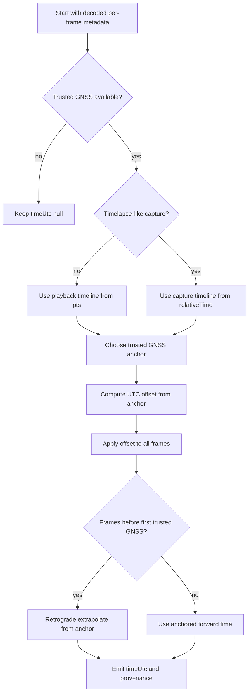

# Technical Notes

This document collects implementation detail that is useful for maintainers and downstream integrators but is too detailed for the main `README.md`.

## Per-frame time model

The library exposes two distinct time axes for each frame:

- `pts`
  - playback timeline from the encoded video stream
- `relativeTime`
  - capture-relative timeline used to model when frames were actually acquired

These can diverge for timelapse-like files.

Example:

- playback stream may be encoded at about `29.97 fps`
- actual capture cadence may be `2 fps`

In that case:

- `pts` advances by about `0.0333667 s`
- `relativeTime` advances by `0.5 s`

### Absolute time policy

Absolute UTC time should be anchored from trusted GNSS metadata, not from nominal video fps.

Important rules:

- GNSS can be missing at the start of a video
- GNSS can drop out during a video
- early GNSS can contain implausible absolute dates, including the wrong year
- presentation timestamp (`PTS`) is the reliable relative clock inside the video

So the working model is:

- `PTS` gives reliable relative ordering and playback timing
- trusted GNSS gives absolute UTC anchoring
- if the first trusted GNSS anchor occurs later in the video, earlier frames can be assigned UTC by retrograde extrapolation from that later anchor using the relative/capture timeline

### Flow chart



## Heading, roll, and pitch

The primary orientation outputs of the library are the raw vectors:

- `MNOR`
- `GRAV`

Any conversion of those vectors into heading, roll, or pitch depends on the axis convention chosen by the consuming application.

The demo CLI currently emits derived angles using the following example formulas:

```text
magneticHeading = atan2(mnor.z, mnor.x) * 180 / pi - 180
magneticPitch   = atan(mnor.y / mnor.z) * 180 / pi

gravityRoll     = atan2(-grav.x, grav.y) * 180 / pi
gravityPitch    = atan2(grav.z, grav.y) * 180 / pi
```

These are practical demo conventions, not universal truth.

### Why these formulas are not universal

The correct interpretation depends on choices such as:

- which camera/body axis is treated as forward
- whether the consuming application uses a viewer-space, body-space, or world-space convention
- whether the gravity vector is interpreted as `[x, y, z]` directly or remapped before deriving angles
- whether heading is expected relative to magnetic north, image yaw zero, or some application-specific forward direction

So downstream applications should treat:

- raw `MNOR`
- raw `GRAV`

as the primary source of truth, and derived angles as application-level helper values.

## JSON CLI output shape

The `frames-json` CLI command writes one JSON record per frame with:

- `frameIndex`
- `pts`
- `relativeTime`
- `timeUtc`
- `timeUtcMode`
- `timeUtcConfidence`
- `gps9`
- `mnor`
- `grav`
- `magneticHeading`
- `magneticPitch`
- `gravityRoll`
- `gravityPitch`

If telemetry for a field is unavailable on a frame, the field is written as `null`.
