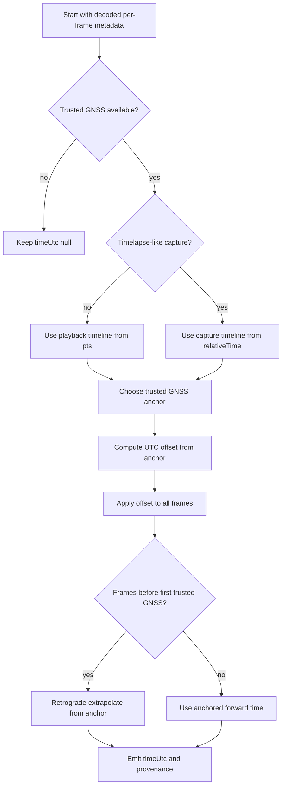

# Technical Notes

## Calculating frame absolute time

Absolute UTC time is determined from GNSS metadata, but there are some complications: 

- GNSS can be missing or unreliable at the start of a video
- GNSS can drop out during a video

So to determine the absolute timestamp for every frame, a combination of GNSS and extrapolation using PTS (presentation timestamp) is used. However there is an additional complication: for timelapse videos PTS is the timestamp at recommended playback speed (usually 29.97 fps) so PTS must be adjusted for the capture frame rate which is provided by the `RATE` GPMF message.



## Heading, roll, and pitch

The primary orientation outputs of the library are the raw vectors:

- `MNOR`
- `GRAV`

Any conversion of those vectors into heading, roll, or pitch depends on the axis convention chosen by the consuming application.

The demo CLI currently emits derived angles using the following example formulas:

```text
magneticHeading = atan2(mnor.z, mnor.x) * 180 / pi - 180
magneticPitch   = atan(mnor.y / mnor.z) * 180 / pi

gravityRoll     = atan2(-grav.x, grav.y) * 180 / pi
gravityPitch    = atan2(grav.z, grav.y) * 180 / pi
```

These are practical demo conventions, not universal truth.

### Why these formulas are not universal

The correct interpretation depends on choices such as:

- which camera/body axis is treated as forward
- whether the consuming application uses a viewer-space, body-space, or world-space convention
- whether the gravity vector is interpreted as `[x, y, z]` directly or remapped before deriving angles
- whether heading is expected relative to magnetic north, image yaw zero, or some application-specific forward direction

So downstream applications should treat:

- raw `MNOR`
- raw `GRAV`

as the primary source of truth, and derived angles as application-level helper values.

## JSON CLI output shape

The `frames-json` CLI command writes one JSON record per frame with:

- `frameIndex`
- `pts`
- `relativeTime`
- `timeUtc`
- `timeUtcMode`
- `timeUtcConfidence`
- `gps9`
- `mnor`
- `grav`
- `magneticHeading`
- `magneticPitch`
- `gravityRoll`
- `gravityPitch`

If telemetry for a field is unavailable on a frame, the field is written as `null`.

## References

 * https://github.com/gopro/gpmf-parser
   
